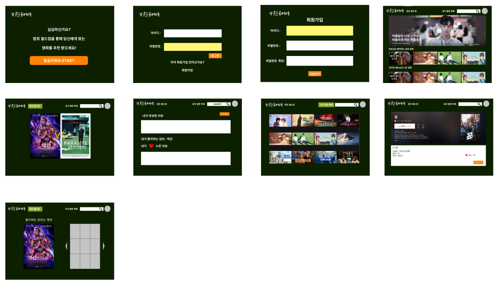
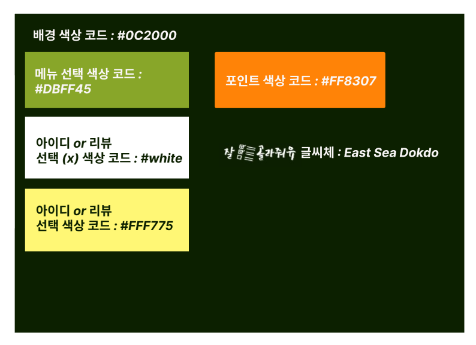
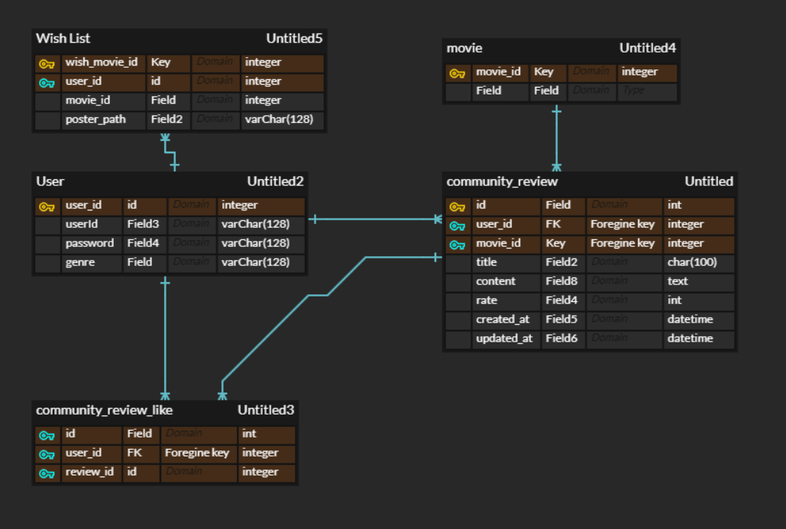

[TOC]

# final-pjt

| 항목        | 설명                                                         |
| ----------- | ------------------------------------------------------------ |
| 팀명        | 잘굴러가유<br /> |
| 팀원        | 강장호,권다솜,조항주                                         |
| 역할        | front : 권다솜, 조항주<br />back : 강장호                    |
| 프로젝트 명 | 잘골라줘유<br />    |

## 1.목표

`잘골라줘유`를 사용하는 user 개인의 취향을 반영하여 영화를 추천한다.

## 2.준비사항

- 언어 : django, vue, python, javascript
- 도구 : vscode, chrome, figma, ERDCloud, TMDB API, git, Typora

## 3.프로젝트 컨셉 주요기능

- 컨셉 : 잘 골라주는 사이트

- 주요 기능 : 장르 월드컵

## 4.요구사항

**[ accounts ]**

| HTTP method | URL 패턴            | component       | 설명                   |
| ----------- | ------------------- | :-------------- | ---------------------- |
| GET         | /                   | MainUnlogin.vue |                        |
| GET         | /accounts/login     | LoginView.vue   | 로그인 페이지 렌더링   |
| POST        | /accounts/login     |                 | 로그인 요청            |
| POST        | /accounts/logout    |                 | 로그아웃 요청          |
| GET         | /accounts/signup    | SignupView.vue  | 회원가입 페이지 렌더링 |
| POST        | /accounts/signup    |                 | 회원가입 요청          |
| GET         | /accounts/{user_id} |                 | 유저페이지 렌더링      |

**[ articles ]**

| HTTP method | URL 패턴                                  | component            | 설명                          |
| ----------- | ----------------------------------------- | :------------------- | ----------------------------- |
| GET         | /articles                                 | MainLogin.vue        | 메인페이지 렌더링             |
| GET         | /articles/genrewc                         | Genrewc.vue          | 장르월드컵 페이지 렌더링      |
| GET         | /articles/genrewc/{genre_id}              | GenrewcResult.vue    | 장르월드컵 결과 페이지 렌더링 |
| POST        | /articles/genrewc/{genre_id}              |                      | db에 유저의 장르 id 저장      |
| GET         | /articles/{movie_id}                      |                      | 영화 상세페이지 렌더링        |
| GET         | /articles/{movie_id}/reviews/             |                      | 리뷰 리스트 요청              |
| POST        | /articles/{movie_id}/reviews/             |                      | 리뷰생성 요청                 |
| POST        | /articles/{movie_id}/like/{review_id}/    |                      | 리뷰 좋아요 요청              |
| GET         | /articles/{movie_id}/reviews/{review_id}/ | ReviewUpdateForm.vue | 리뷰업데이트 페이지 렌더링    |
| PUT         | /articles/{movie_id}/reviews/{review_id}/ |                      | 리뷰수정 요청                 |
| DELETE      | /articles/{movie_id}/reviews/{review_id}/ |                      | 리뷰삭제 요청                 |
| GET         | /accounts/wishlist/                       |                      | 사용자가 찜한 영화            |
| POST        | /accounts/wishlist/                       |                      | 찜한 영화 사용자에 저장       |


articles(유배)

| HTTP method | URL 패턴                         | component            | 설명                          |
| ----------- | -------------------------------- | :------------------- | ----------------------------- |
| GET         | /                                | MainLogin.vue        |                               |
| GET         | /articles/genrewc                | Genrewc.vue          | 장르월드컵 페이지 렌더링      |
| GET         | /articles/genrewc/{genre_id}     | GenrewcResult.vue    | 장르월드컵 결과 페이지 렌더링 |
| POST        | /articles/genrewc/{genre_id}     |                      | db에 유저의 장르 id 저장      |
| GET         | /articles/reviewlist             | ReviewList.vue       | 리뷰게시판 페이지 렌더링      |
| GET         | /articles/reviewlist/create      | ReviewCreateForm.vue | 리뷰생성 페이지 렌더링        |
| POST        | /articles/reviewlist/create      |                      | 리뷰생성 요청                 |
| GET         | /articles/reviewlist/{id}detail/ | ReviewDetail.vue     | 리뷰디테일 페이지 렌더링      |
| GET         | /articles/reviewlist/{id}update/ | ReviewUpdateForm.vue | 리뷰업데이트 페이지 렌더링    |
| POST        | /articles/reviewlist/{id}update/ |                      | 리뷰수정 요청                 |
| POST        | /articles/reviewlist/{id}delete/ |                      | 리뷰삭제 요청                 |
| GET         | /articles/{movie_id}             |                      |                               |


## 5. 프로젝트 개발 일지

### 0517

#### 오늘의 진행과정

1. 피그마(툴)를 사용하여 웹 레이아웃 작성

   

   

2. ERDCloud를 사용하여 ERD 작성

   

#### 오늘의 위기

1. `진행과정1` 피그마 사용법 미숙
   - 해결방법 : 몸으로 부딪힌다... (with. 구선생님)
2. `진행과정1` 메인 색상 팔레트 결정 난제
   - 해결방법 : 여러색상을 적용하여 제일 나은 색 조합을 선택함 -> 테마는 학교 칠판

---

### 0519 

#### 오늘의 진행과정

1. django pjt 생성
2. model 작성

#### 오늘의 위기

1. `진행과정2` movie 데이터를 db에 저장하지 않아 fk 설정에 어려움 발생 
   - 해결방법 : review model에서 movie_id 필드를 fk로 안하고 int로 설정 후 우리가 fk처럼 사용하기로 정함

---

### 0520

#### 오늘의 진행과정

1. db에 데이터 저장 여부 결정

   - 결정 사항 : 저장하지 않고 필요한 경우에만, 필요 데이터 호출하여 사용함

     | 페이지    | component      | api                                      | 비고                                           |
     | --------- | -------------- | ---------------------------------------- | ---------------------------------------------- |
     | 메인      | 제일 상단 사진 | **GET**/movie/now_playing                |                                                |
     | 메인      | 장르 같은 영화 | **GET**/movie/popular                    | 렌덤으로 페이지 정해서 같은 장르 영화 가져오기 |
     | 메인      | 배우 영화      | **GET**/person/{person_id}/movie_credits |                                                |
     | 디테일    | 예고편         | **GET**/movie/{movie_id}/videos          |                                                |
     | 찜한 목록 | 디테일         | GET movie/{movie_id}                     |                                                |

2. Components 재확인 및 model & ERD 수정

   - 메인 페이지 : 베너는 넷플릭스처럼 한가지만 보임 (영화 제목 + 포스터)

3. front(조항주,권다솜) 와 back(강장호)으로 역할 분담

   - front(vue) : login / logout / signup
   - back(django) : login / logout / signup / profile(without articles)

---

**[ 야근 ]**

4. front(조항주,권다솜) & back(강장호)
   - front : 로그인 했을 때 보이는 메인 페이지 생성 [ navbar만 생성했음,,, search bar 어케하는거냐고,,,, ]
   - back : 영화 리뷰 생성 [ 현재 진행상황 : 실패,,,:bomb: ]

#### 오늘의 위기

1. `진행과정2` django의 accounts/model.py에서 genre_id가 user를 생성할 때 에러가 발생함
   - 해결방법 : default=0 속성을 준다.
   
2. `진행과정3` vue : login 하는 과정에서 이해가 부족함
   - 해결방법 : 유튜브 라이브 교수님 코드를 천천히 살펴봄.
   
3. `진행과정4` front : views에 `Ariticles.vue`로 파일명을 정했을때, **Component name "Articles" should always be multi-word  vue/multi-word(컴포넌트 이름은 항상 여러 단어로 되어야 한다.)**
   - 해결방법 : ArticlesView로 이름을 변경해줌.
   
4. `진행과정4` back : review 생성이 안됨,,,,,,, 왜 안돼? ,,,,, 좀 잘 되면 얼마나 좋겠냐!!!!!!!

   - 해결방법 : 

     ```python
     reviews = get_list_or_404(Review)
     serializer.save(user=user)
     ```

     리뷰모델이 비어있을 때 get_list_or_404를 호출하는 경우를 고려했음

     serializer 데이터를 저장할 때 movie_id를 따로 인자로 받지 않게 수정

---

### 0521

#### 오늘의 진행과정

##### django

- review CRUD 구현 및 테스트

  ```python
      def seleted_movie(reviews, movie_pk):
          reviews_seleted_movie = []
          for review in reviews:
              if review.movie_id == movie_pk:
                  reviews_seleted_movie.append(review)
          return reviews_seleted_movie
  ```

  - movie를 장고에 저장하지 않기때문에 orm함수를 사용할 수 없음
  - 따라서 list전체를 받고 거기서 movie_pk값에 맞는 review들을 Response해주어야 함
  - 그에 따른 함수를 구현 => movie_id와 movie_pk이 같은 값들을 리스트에 모아 json으로 보내준다

- review_ like 구현

##### vue

- ArticlesView 의 MainMovieCard 컴포넌트 구현
  - dfs에 tmdb url 추가
  - axios 요청으로 nowPlaying 데이터를 가져와서 lodash 랜덤으로 영화의 backdrop_path와 title를 가져와서 페이지에 보여줌

#### 


### 0522

#### 오늘의 진행과정

##### django

- wish list show and save 구현 및 테스트

  ```python
  user = request.user
  movie_id = request.data['movie_id']
  wish_list = WishList.objects.all().filter(user_id=user)
  
  # 위시무비 id 값만 불러오기
  wish_movie_id = []
  for wish in wish_list:
  	wish_movie_id.append(wish.movie_id)
  
  # wish_movie_id값안에 값이 있으면 ==> 삭제
  if movie_id in wish_movie_id:
  	wish_object = get_object_or_404(WishList,user_id=user,movie_id=movie_id)
  	wish_object.delete()
  	serializers = WishListSerializer(wish_object)
  	return Response(serializers.data)
  
  else:
      없으면 저장
  
  ```

- 오늘의 위기

  - movie_id값을 request로 받아오기 때문에 데이터에서 dictionary로 받아와야 함
  - wish_list를 받아올때 get_list_or_404로 받아오지 못함
    - 왜냐하면 새로운 유저가 찜을 눌렀을때 아무것도 없을시에 404에러가 뜨게 된다
    - 이렇게 되면 안되기 때문에 빈리스트로 마무리를 시켜준다
  - for문을 이용하여 movie id 값만 받아와서 비교한다.
  - if 문을 사용해서 리스트에 있는 id값의 존재 여부를 비교한다.
    - 리스트를 써도 되는 이유 : 한유저가 아무리 많은 영화를 눌러도 얼마 안될 것이기 때문에

##### vue

- 데이터 흐름 변경
  MainMovieCard 컴포넌트에서 axios 요청을 통해 데이터를 가져오던걸 부모 컴포넌트인 ArticleView 컴포넌트에서 가져와서 props로 전달해주는 방식으로 변경

- ArticlesVies.vue의 getNowPlayingMovie() 메서드 분리
  기존에 api요청을 보내서 현재 상영중인 영화를 가져오고 그 안에서 렌덤으로 데이터 하나를 저장했던 getNowPlayingMovie() 를 
  현재 상영중인 영화 데이터를 저장하는 getNowPlayingMovieList()와 그 안에서 렌덤 영화를 저장하는 getRandMovieData()로 분리함

- 오늘의 위기
  created 라이프 싸이클 훅이 동기적으로 코드가 실행되지 않는거 같다,,, 현재 상영중인 영화 정보를 먼저 가져오고 랜덤 무비를 가져와야 되는데 그게 안돼

  ```js
  created(){
      this.getNowPlayingMovieList()
      this.getRandMovieData()
    },
  mounted() {
      this.getRandMovieData()
    },
  ```

  이런식으로 짜면 안돼 그래서 

  ```vue
  <template>
    <div>
      {{getRandMovieData()}}
      <MainMovieCard :backdrop-path="mainMovieBackdropPath" :title="mainMovietitle"></MainMovieCard>
    </div>
  </template>
  ```

  일단 임시로 이렇게 실행시켜놨습니다,,


### 0523

#### 오늘의 진행과정

##### django

- wish list save할때 반환 값이 object에서 list값으로 변경
- review를 달때 한영화에 하나의 review만 쓸수 있도록 변경
- review list에 평점 추가
- 프로필 창에 좋아하는 리뷰, 좋아하는 리뷰의 개수, 내가 작성한 리뷰와 개수 추가
- 


##### vue

- 로그인 시에도 8080/ 로 접속했을 때 로그인 페이지가 렌더링 되는 문제 해결
  MainUnlogin.vue 의 created 라이프사이클 훅에 로그인시 articles로 라우팅 되는 메서드를 걸어둠
- 비로그인 시 /articles로 접속되는 문제 해결
- 장르 영화 추천 목록 생성
  
- 배우 영화 추천 목록 생성
- 현재 상영중 영화 추천 목록 생성
